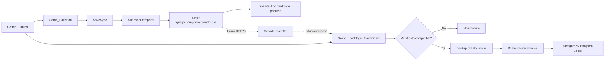
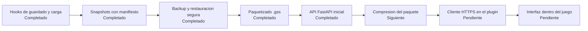

# GothicSaveSync

Sincronizacion de partidas guardadas de Gothic entre dispositivos, integrada como plugin de Union.

> Estado actual: snapshots locales paquetizados y restauracion segura.
> El servidor HTTP inicial ya esta implementado; falta conectarlo al plugin.

## Ultimos cambios

- Renombrado el proyecto y la carpeta principal a `GothicSaveSync`.
- Añadida la paquetizacion binaria `.gss` de partidas guardadas.
- Añadida restauracion segura con validacion de hash y backup automatico.
- Añadido un servicio web FastAPI para subir, listar, descargar y eliminar paquetes.
- Añadido soporte Docker preparado para desplegar el servidor en Render.

Documentacion directa del servidor: [server/README.md](server/README.md)

## Que hace ahora

GothicSaveSync observa el ciclo de guardado y carga del juego:

- Detecta el slot al terminar un guardado.
- Empaqueta el slot completo en un unico archivo `.gss` sin modificar el guardado original durante la copia.
- Escribe un manifiesto con el slot y el hash del ejecutable de Gothic.
- Valida la cabecera del paquete, el slot, el hash y las rutas internas antes de desempaquetar.
- Valida la compatibilidad antes de restaurar una partida.
- Conserva un backup del slot actual antes de reemplazarlo.
- Recupera el backup si la restauracion falla.
- Compila para Gothic I, Gothic I Addon, Gothic II y Gothic II Addon.

## Arquitectura



## Flujo de archivos

```text
<Saves>/
├── savegame1/                    # Guardado original de Gothic
└── save-sync/
    ├── pending/
    │   └── savegame1.gss         # Paquete transportable
    └── backup/
        └── savegame1/            # Backup antes de restaurar
```

Los snapshots se preparan primero en carpetas y archivos temporales. Solo se reemplaza el paquete anterior cuando la copia y la escritura completa han terminado correctamente.

## Formato `.gss`

El paquete usa un formato binario propio y versionado:

```text
cabecera: magic, version, slot, gothic_hash, numero_de_archivos
repetido por archivo:
    longitud de ruta relativa
    tamano del archivo
    ruta relativa
    contenido binario
```

Las rutas absolutas y los segmentos `..` se rechazan durante la lectura. Esto permite transportar una partida como un solo archivo sin depender de ZIP ni de librerias externas. La compresion se puede añadir despues sin cambiar el flujo de validacion.

## Proyecto

```text
GothicSaveSync/
├── .vscode/
│   ├── c_cpp_properties.json
│   └── tasks.json
├── GothicSaveSync/
│   ├── GothicSaveSync.vcxproj
│   ├── Plugin/
│   │   ├── SaveSync.cpp
│   │   ├── SaveSync.h
│   │   ├── plugin.cpp
│   │   └── plugin.h
│   ├── GothicAPI/
│   └── UnionSDK/
└── README.md
```

La carpeta `GothicSaveSync` contiene el plugin, las APIs de Gothic y el SDK de Union. El proyecto compilable tambien se llama `GothicSaveSync`.

El servicio web esta en `server/` y tiene su propia documentacion, dependencias y [Dockerfile](server/Dockerfile) para Render.

## Compilar

Requisitos:

- Windows
- Visual Studio 2022 con herramientas C++ Win32
- MSBuild disponible en `PATH`
- SDK de Union incluido en `GothicSaveSync/UnionSDK`

Desde VS Code:

1. Abrir la tarea `Compilar GothicSaveSync`.
2. Ejecutarla con `Ctrl+Shift+B`.

Desde una terminal de desarrollador:

```powershell
msbuild GothicSaveSync/GothicSaveSync.vcxproj /p:Configuration=Release /p:Platform=x86
```

Las configuraciones especificas disponibles son `G1 Release`, `G1A Release`, `G2 Release` y `G2A Release`.

## Estado y roadmap



Proximos pasos:

1. Añadir compresion opcional al paquete.
2. Conectar el plugin C++ con la API mediante HTTPS.
3. Implementar identificacion de dispositivo y lista de partidas remotas.
4. Añadir una interfaz de sincronizacion al menu de Gothic.
5. Resolver conflictos entre partidas modificadas en dos dispositivos.

## Limitaciones actuales

- El servidor existe, pero el plugin todavía no realiza peticiones HTTPS.
- Render necesita almacenamiento persistente o almacenamiento de objetos para conservar paquetes tras reinicios.
- La restauracion automatica se ejecuta al cargar un slot compatible que tenga un snapshot pendiente.
- La prueba actual es de compilacion; falta validar el ciclo completo con una instalacion real de Gothic y una partida real.

## Licencia

Este proyecto usa el SDK de Union incluido en el repositorio. Consulta sus archivos de licencia para las condiciones aplicables.
