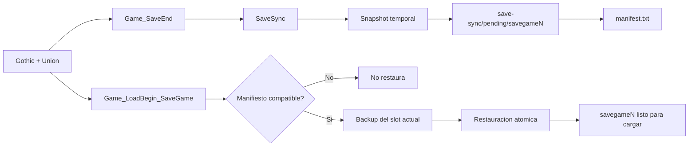
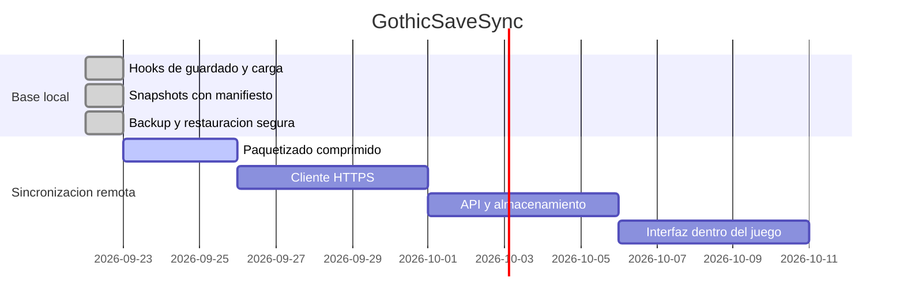

# GothicSaveSync

Sincronizacion de partidas guardadas de Gothic entre dispositivos, integrada como plugin de Union.

> Estado actual: primera version funcional de snapshots locales y restauracion segura.
> La sincronizacion remota todavia esta en el roadmap.

## Que hace ahora

GothicSaveSync observa el ciclo de guardado y carga del juego:

- Detecta el slot al terminar un guardado.
- Copia el slot completo sin modificar el guardado original durante la copia.
- Escribe un manifiesto con el slot y el hash del ejecutable de Gothic.
- Valida la compatibilidad antes de restaurar una partida.
- Conserva un backup del slot actual antes de reemplazarlo.
- Recupera el backup si la restauracion falla.
- Compila para Gothic I, Gothic I Addon, Gothic II y Gothic II Addon.

## Arquitectura



## Flujo de archivos

```text
<Saves>/
├── savegame1/                    # Guardado original de Gothic
└── save-sync/
    ├── pending/
    │   └── savegame1/            # Snapshot que se puede sincronizar
    │       └── manifest.txt      # Formato, slot y gothic_hash
    └── backup/
        └── savegame1/            # Backup antes de restaurar
```

Los snapshots se preparan primero en una carpeta temporal. Solo se reemplaza el snapshot anterior cuando la copia completa ha terminado correctamente.

## Proyecto

```text
GothicSaveSync/
├── .vscode/
│   ├── c_cpp_properties.json
│   └── tasks.json
├── GothicSaveSync/
│   ├── GothicSaveSync.vcxproj
│   ├── Plugin/
│   │   ├── SaveSync.cpp
│   │   ├── SaveSync.h
│   │   ├── plugin.cpp
│   │   └── plugin.h
│   ├── GothicAPI/
│   └── UnionSDK/
└── README.md
```

La carpeta `GothicSaveSync` contiene el plugin, las APIs de Gothic y el SDK de Union. El proyecto compilable tambien se llama `GothicSaveSync`.

## Compilar

Requisitos:

- Windows
- Visual Studio 2022 con herramientas C++ Win32
- MSBuild disponible en `PATH`
- SDK de Union incluido en `GothicSaveSync/UnionSDK`

Desde VS Code:

1. Abrir la tarea `Compilar GothicSaveSync`.
2. Ejecutarla con `Ctrl+Shift+B`.

Desde una terminal de desarrollador:

```powershell
msbuild GothicSaveSync/GothicSaveSync.vcxproj /p:Configuration=Release /p:Platform=x86
```

Las configuraciones especificas disponibles son `G1 Release`, `G1A Release`, `G2 Release` y `G2A Release`.

## Estado y roadmap



Proximos pasos:

1. Empaquetar cada snapshot en un archivo transportable.
2. Añadir subida y descarga HTTPS fuera del hilo principal del juego.
3. Implementar identificacion de dispositivo y lista de partidas remotas.
4. Añadir una interfaz de sincronizacion al menu de Gothic.
5. Resolver conflictos entre partidas modificadas en dos dispositivos.

## Limitaciones actuales

- Todavia no hay servidor ni subida a Internet.
- La restauracion automatica se ejecuta al cargar un slot compatible que tenga un snapshot pendiente.
- La prueba actual es de compilacion; falta validar el ciclo completo con una instalacion real de Gothic y una partida real.

## Licencia

Este proyecto usa el SDK de Union incluido en el repositorio. Consulta sus archivos de licencia para las condiciones aplicables.
