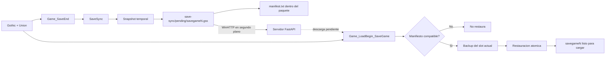
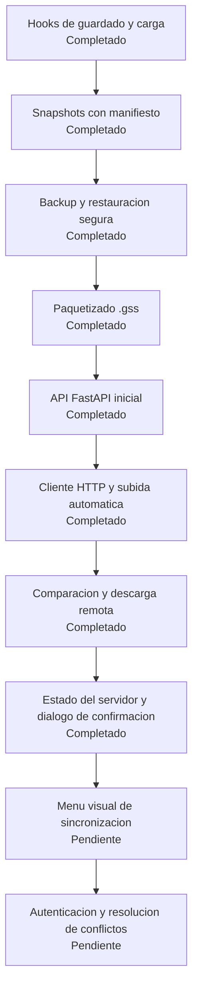

# GothicSaveSync

Sincronizacion de partidas guardadas de Gothic entre dispositivos, integrada como plugin de Union.

> Estado actual: snapshots locales paquetizados, restauracion segura y sincronizacion HTTP basica.

## Ultimos cambios

- Renombrado el proyecto y la carpeta principal a `GothicSaveSync`.
- Añadida la paquetizacion binaria `.gss` de partidas guardadas.
- Añadida restauracion segura con validacion de hash y backup automatico.
- Añadido un servicio web FastAPI para subir, listar, descargar y eliminar paquetes.
- Añadido soporte Docker preparado para desplegar el servidor en Render.
- Añadido cliente WinHTTP en segundo plano para consultar y subir partidas.
- Añadida configuracion `.env` para indicar la URL del servidor.

Documentacion directa del servidor: [server/README.md](server/README.md)

## Seguridad y deteccion por antivirus

El plugin realiza conexiones salientes mediante la API nativa `WinHTTP`. Solo
contacta con la URL configurada en `GOTHICSAVE_SERVER_URL`, consulta el estado
y la lista de partidas, y sube o descarga paquetes `.gss` durante la
sincronizacion. No abre puertos de escucha ni ejecuta contenido descargado.

Al ser una DLL de mod no firmada digitalmente, algunos antivirus o Windows
SmartScreen pueden mostrar un aviso o clasificarla como sospechosa. Esto puede
ser un falso positivo por la combinacion de DLL inyectada, acceso a archivos y
red; no es una garantia de que cualquier binario distribuido con el nombre del
proyecto sea seguro. Descarga el plugin de una fuente de confianza y revisa el
hash del archivo.

Steam normalmente no bloquea un mod de un juego individual por usar WinHTTP,
pero no se debe usar este plugin en juegos con anti-cheat o en contextos donde
se prohiban DLLs externas sin comprobar antes sus reglas. GothicSaveSync no
lee credenciales de Supabase: la clave privilegiada pertenece exclusivamente
al servidor y nunca debe copiarse al `.env` del juego.

Para reducir riesgos:

- Usa una URL `https://` de un servidor que controles.
- No configures en el juego una URL desconocida ni compartas paquetes con ella.
- Mantén una copia local y conserva los backups antes de restaurar.
- Si el antivirus bloquea la DLL, verifica el binario y su hash antes de crear
  una excepción; no desactives el antivirus globalmente.

## Que hace ahora

GothicSaveSync observa el ciclo de guardado y carga del juego:

- Detecta el slot al terminar un guardado.
- Empaqueta el slot completo en un unico archivo `.gss` sin modificar el guardado original durante la copia.
- Escribe un manifiesto con el slot y el hash del ejecutable de Gothic.
- Valida la cabecera del paquete, el slot, el hash y las rutas internas antes de desempaquetar.
- Valida la compatibilidad antes de restaurar una partida.
- Conserva un backup del slot actual antes de reemplazarlo.
- Recupera el backup si la restauracion falla.
- Compila para Gothic I, Gothic I Addon, Gothic II y Gothic II Addon.

## Arquitectura



## Sincronizacion con servidor

El plugin busca un archivo `.env` en la carpeta principal de Gothic, junto al
ejecutable del juego. Se puede crear copiando [.env.example](.env.example):

```env
GOTHICSAVE_SERVER_URL=https://tu-servicio.onrender.com
```

En una instalación de Steam la estructura debe quedar así:

```text
Gothic II\
├── Gothic2.exe
├── .env
└── system\
    └── Autorun\
        └── GothicSaveSync.dll
```

El `.env` no va dentro de `system`; debe estar junto a `Gothic2.exe`. La DLL
debe corresponder a la variante compilada: `G2 Release` para Gothic II Classic
o `G2A Release` para Gothic II Gold/NotR. Inicia el juego mediante
`GothicStarter_mod.exe` cuando uses Union.

Al arrancar, consulta `GET /saves` en segundo plano y guarda la respuesta
ordenada por ultima modificacion en `<Gothic>/save-sync/remote.json`. Al
terminar cada guardado, sube automaticamente el paquete `.gss` del slot a
`POST /saves/{slot}` sin bloquear el hilo principal.

Antes de consultar las partidas, el plugin verifica `GET /status`. La
interfaz muestra si el servidor remoto esta disponible y permite continuar
usando las partidas locales aunque no haya conexion.

Si existen paquetes remotos mas recientes, el juego muestra una pregunta de
confirmacion. Si se acepta, los paquetes se descargan a `save-sync/pending`.
Al cargar cada slot, el flujo de restauracion existente conserva el guardado
local en `save-sync/backup` antes de reemplazarlo.

## Ventana quirurgica de desarrollador

Pulsa `F10` dentro del juego para abrir la interfaz de desarrollador. La
primera version se presenta como dos paneles de dialogo nativos de Union:

- **Servidor remoto:** descargar manualmente los paquetes remotos mas recientes.
- **Partidas locales y backups:** restaurar el backup del slot actual sin
  eliminar el backup conservado.

La interfaz no reemplaza el aviso automatico de sincronizacion. El menu visual
con listas de slots, nombres y fechas se añadira cuando terminemos el sistema
de controles del menu para las cuatro variantes de Gothic.

## Flujo de archivos

```text
<Saves>/
├── savegame1/                    # Guardado original de Gothic
└── save-sync/
    ├── pending/
    │   └── savegame1.gss         # Paquete transportable
    └── backup/
        └── savegame1/            # Backup antes de restaurar
```

Los snapshots se preparan primero en carpetas y archivos temporales. Solo se reemplaza el paquete anterior cuando la copia y la escritura completa han terminado correctamente.

## Formato `.gss`

El paquete usa un formato binario propio y versionado:

```text
cabecera: magic, version, slot, gothic_hash, numero_de_archivos
repetido por archivo:
    longitud de ruta relativa
    tamano del archivo
    ruta relativa
    contenido binario
```

Las rutas absolutas y los segmentos `..` se rechazan durante la lectura. Esto permite transportar una partida como un solo archivo sin depender de ZIP ni de librerias externas. La compresion se puede añadir despues sin cambiar el flujo de validacion.

## Proyecto

```text
GothicSaveSync/
├── .vscode/
│   ├── c_cpp_properties.json
│   └── tasks.json
├── GothicSaveSync/
│   ├── GothicSaveSync.vcxproj
│   ├── Plugin/
│   │   ├── SaveSync.cpp
│   │   ├── SaveSync.h
│   │   ├── plugin.cpp
│   │   └── plugin.h
│   ├── GothicAPI/
│   └── UnionSDK/
└── README.md
```

La carpeta `GothicSaveSync` contiene el plugin, las APIs de Gothic y el SDK de Union. El proyecto compilable tambien se llama `GothicSaveSync`.

El servicio web esta en `server/` y tiene su propia documentacion, dependencias y [Dockerfile](server/Dockerfile) para Render.

## Compilar

Requisitos:

- Windows
- Visual Studio 2022 con herramientas C++ Win32
- MSBuild disponible en `PATH`
- SDK de Union incluido en `GothicSaveSync/UnionSDK`

Desde VS Code:

1. Abrir la tarea `Compilar GothicSaveSync`.
2. Ejecutarla con `Ctrl+Shift+B`.

Desde una terminal de desarrollador:

```powershell
msbuild GothicSaveSync/GothicSaveSync.vcxproj /p:Configuration=Release /p:Platform=x86
```

Las configuraciones especificas disponibles son `G1 Release`, `G1A Release`, `G2 Release` y `G2A Release`.

## Estado y roadmap



Proximos pasos:

1. Añadir identificacion de dispositivo y autenticacion.
2. Añadir compresion opcional al paquete.
3. Crear un menu visual de sincronizacion para Gothic.
4. Resolver conflictos entre partidas modificadas en dos dispositivos.

## Limitaciones actuales

- La sincronizacion requiere aceptar el aviso del juego antes de descargar.
- La interfaz actual usa los dialogos de Union; todavía no añade controles propios al menú nativo.
- Render necesita almacenamiento persistente o almacenamiento de objetos para conservar paquetes tras reinicios.
- La restauracion automatica se ejecuta al cargar un slot compatible que tenga un snapshot pendiente.
- La prueba actual es de compilacion; falta validar el ciclo completo con una instalacion real de Gothic y una partida real.

## Licencia

Este proyecto usa el SDK de Union incluido en el repositorio. Consulta sus archivos de licencia para las condiciones aplicables.
