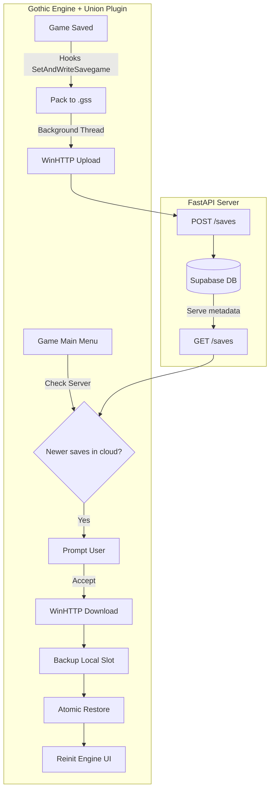

# GothicSaveSync

GothicSaveSync is a comprehensive cloud-save synchronization plugin for the classic Gothic engine (ZenGin), built natively with the Union SDK. It seamlessly synchronizes save games across multiple devices using a bespoke binary packing system and a modern Python/FastAPI backend.

> **Status:** Fully functional automatic background syncing, secure local binary packaging, dynamic UI refreshes, and Supabase integration.

## Key Features

- **Transparent Background Syncing**: Save games are automatically uploaded to the cloud in the background exactly when the game engine finishes writing them to disk.
- **In-Game Cloud Prompts**: Upon launching the game, the plugin checks for newer saves in the cloud. If found, an in-game prompt allows you to download and restore them seamlessly.
- **Dynamic UI Refresh**: Gothic's internal savegame manager is dynamically reinitialized after a cloud download, allowing the native Load Game menu to instantly reflect the new save names and timestamps without restarting the game.
- **Atomic Restoration & Backups**: Every cloud restoration is atomic. The plugin creates a local backup of your current save slot before overwriting it, ensuring you never lose data due to a network interruption.
- **Bespoke `.gss` Binary Packages**: Save games are packed into a custom binary format (`.gss`) that validates the Gothic executable hash, slot ID, and file paths to prevent corruption and ensure cross-version safety.
- **Universal Compatibility**: Compiles and runs on all engine variants: Gothic I Classic, Gothic I Addon, Gothic II Classic, and Gothic II NotR / Gold.

## Architecture & Flow


```mermaid
flowchart TD
    subgraph Client [Gothic Engine + Union Plugin]
        S[Game Saved] -->|Hooks SetAndWriteSavegame| P[Pack to .gss]
        P -->|Background Thread| U[WinHTTP Upload]
        
        M[Game Main Menu] -->|Check Server| C{Newer saves in cloud?}
        C -- Yes --> D[Prompt User]
        D -- Accept --> DL[WinHTTP Download]
        DL --> B[Backup Local Slot]
        B --> R[Atomic Restore]
        R --> I[Reinit Engine UI]
    end

    subgraph Backend [FastAPI Server]
        U --> API[POST /saves]
        API --> DB[(Supabase DB)]
        DB -->|Serve metadata| GET[GET /saves]
        GET --> C
    end
```

## Setup & Installation

### 1. Server Configuration
GothicSaveSync reads its configuration from the native `Gothic.ini` file. Add the following section to `system\Gothic.ini`:

```ini
[GOTHICSAVESYNC]
ServerURL=https://your-service-url.onrender.com
```

### 2. Plugin Installation
In a standard Steam installation, place the compiled DLL into the `Autorun` directory:

```text
Gothic II\
├── Gothic2.exe
└── system\
    ├── Gothic.ini
    └── Autorun\
        └── GothicSaveSync.dll
```

*Note: Ensure you are using the correct compiled variant for your game version (e.g., `G2A Release` for Gothic II NotR).* 
Start the game using `GothicStarter_mod.exe` if deploying as a mod.

## Backend Infrastructure

The repository includes a modern backend service located in the `server/` directory.
- Built with **FastAPI** for high-performance asynchronous request handling.
- Backed by **Supabase** for robust metadata storage and file hosting.
- Fully containerized with a `Dockerfile`, ready for zero-configuration deployment to platforms like Render or Heroku.

See [server/README.md](server/README.md) for dedicated backend documentation.

## Security & Antivirus

GothicSaveSync uses native Windows APIs (`WinHTTP`) to perform network requests. It operates strictly within the boundaries of the configured `ServerURL` and does not open listening ports.

Because this is an unsigned injected DLL that performs network I/O and disk operations, some strict antivirus heuristics (or Windows SmartScreen) may flag it as a false positive. 
To minimize risk:
- Always compile the DLL yourself or download it from a trusted release.
- Only connect to a `ServerURL` that you control or explicitly trust.
- Never place Supabase service keys or secrets in your local `Gothic.ini`.

## Developer Tools

Press `F10` while in-game to open the native Union developer interface. This allows you to:
- Force-download the latest remote packages.
- Force-upload your local saves.
- Manually restore local backups if a synchronization failed or was undesired.

## Building from Source

**Requirements:**
- Windows OS
- Visual Studio 2022 with C++ Win32 tools
- MSBuild available in your `PATH`
- Union SDK (included in `GothicSaveSync/UnionSDK`)

**To build via VS Code:**
1. Open the project.
2. Run the `Build GothicSaveSync` task (`Ctrl+Shift+B`).

**To build via CLI:**
```powershell
msbuild GothicSaveSync/GothicSaveSync.vcxproj /p:Configuration="G2A Release" /p:Platform=Win32
```
*Available configurations: `G1 Release`, `G1A Release`, `G2 Release`, and `G2A Release`.*

## Roadmap

- **Remote Server Synchronization [Completed]**: Fully automated background synchronization using a dedicated FastAPI/Supabase backend.
- **Local Network Sync (LAN) [Completed]**: Direct peer-to-peer synchronization across local networks. Devices will be able to auto-discover each other and synchronize the latest saves without relying on an external server.
- **Cloud Provider Integrations [Planned]**: Direct integration with popular cloud storage APIs (Google Drive, Dropbox, OneDrive) to bypass the need for hosting a custom backend server.
- **Native UI & Manual Management [Completed]**: Overhaul the synchronization interface using native Gothic menu elements (`zCView`), allowing for manual per-slot management, explicit conflict resolution, and granular control over what gets uploaded or downloaded.

## License

This project utilizes the Union SDK. Please refer to the SDK's internal documentation for its specific licensing terms. The server and plugin code provided in this repository are available for open use and modification.
